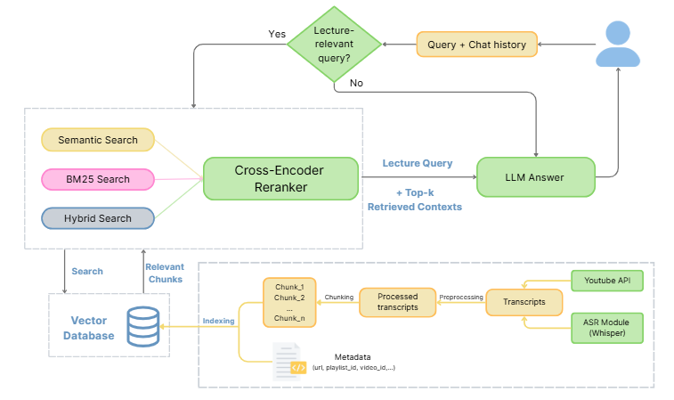

# 🤖 Hệ Thống Hỏi Đáp môn học tại UIT (RAG QABot)

<!-- Logo hoặc hình minh họa nếu có -->
<p align="center">
  
</p>

---

## 📝 Giới thiệu

**RAG QABot** là hệ thống hỏi đáp tự động cho các môn học như CS315 dựa trên mô hình Retrieval-Augmented Generation (RAG). Hệ thống sử dụng dữ liệu bài giảng từ YouTube, trích xuất, xử lý ngôn ngữ tự nhiên, tìm kiếm theo ngữ nghĩa và trả lời kèm nguồn tham khảo, tích hợp trực quan qua Streamlit Frontend & FastAPI Backend, dùng MongoDB làm lưu trữ hội thoại.

---

## 📂 Cấu trúc dự án

```bash
├── app.py                  # Giao diện Streamlit (frontend)
├── server.py               # Backend FastAPI (Xử lý API & lưu hội thoại)
├── requirements.txt        # Thư viện Python
├── Dockerfile              # Build Docker cho server
├── docker-compose.yaml     # Chạy tổng thể (FastAPI, Streamlit, MongoDB)
├── config.yaml             # DS playlist YouTube & cấu hình crawling
├── .env.example            # Biến môi trường mẫu (API keys, MongoDB)
├── DEPLOYMENT.md           # Hướng dẫn triển khai chi tiết
├── rag_chain.png           # Minh họa pipeline RAG
├── chunks/                 # Lưu các đoạn text đã chunk
├── data/                   # Dữ liệu thô hoặc đã xử lý
├── data_loader/            # Tiện ích tải & xử lý dữ liệu
├── database_semantic/      # Lưu trữ/ngữ nghĩa hóa CSDL
├── generation/             # Sinh câu trả lời bằng LLM
├── notebook_baseline/      # Notebook kiểm thử/evaluate mẫu
├── preprocess/             # Tiện ích làm sạch dữ liệu
├── rag/                    # Logic chính của RAG
├── retriever/              # Thành phần tìm kiếm/phục hồi
├── saved_conversations/    # (Cũ) Lưu hội thoại local, nay dùng MongoDB
├── text_splitters/         # Chia nhỏ text/video transcript
├── vector_store/           # Xử lý embedding & DB vector
└── ...
```

---

## 🚀 Cài đặt nhanh

### 1. Yêu cầu

- Python 3.12+
- Docker & docker-compose *(khuyến khích)*
- MongoDB (nếu không dùng docker)

### 2. Cài đặt thủ công

```bash
git clone https://github.com/BPhucKHMT/Rag_QABot.git
cd Rag_QABot
pip install -r requirements.txt
cp .env.example .env
# Chỉnh sửa .env để bổ sung API keys, MongoDB URL...
```

Chỉnh playlist/cấu hình crawl trong `config.yaml`.

### 3. Chạy bằng Docker Compose (Khuyến khích)

```bash
docker-compose up --build
```
- FastAPI backend: http://localhost:8000
- Streamlit UI: http://localhost:8501

---

## 💡 Sử dụng

- Truy cập giao diện người dùng: [http://localhost:8501](http://localhost:8501)
- Đặt câu hỏi về môn học liên quan (ví dụ CS315), hệ thống sẽ tìm ngữ cảnh, trả lời có trích dẫn video nguồn (có timestamp).
- Mọi hội thoại được lưu vào MongoDB, tự động khôi phục khi dùng lại.

### 🔑 Cấu hình

**.env.example** (bắt buộc điền trong `.env` thực tế):

```
myAPIKey = "" # Nếu muốn dùng text embedding openAI
googleAPIKey = ""    #LLM gemini 2.5 flash
YOUTUBE_API_KEY = "" # Nếu muốn update playlist youtube mới
mongodb_url = "mongodb://[username:password@]host:port/puq_qa_bot" # hoặc database của bạn
```
**config.yaml**: chỉ định playlist YouTube và tham số crawling (Nếu muốn mở rộng thêm playlists của bạn)

```yaml
playlists:
  - url: "https://www.youtube.com/playlist?list=..."
    enabled: true
settings:
  sleep_between_videos: 8.0
  limit_per_playlist: null
```

---

## 📊 Đánh giá & kiểm thử

- Vào thư mục `notebook_baseline/` để có notebook/Jupyter kiểm thử pipeline, baseline, chấm điểm (ví dụ: `pipeline.ipynb`, v.v).
- Có thể chạy riêng module chính (test backend):
  ```bash
  python -m rag.main
  ```
- Đánh giá chất lượng dùng thêm các package:
  ```bash
  pip install ragas datasets nest_asyncio pandas tabulate
  ```
---

## 📦 Triển khai

Xem hướng dẫn chi tiết trong [DEPLOYMENT.md](DEPLOYMENT.md).

---

## 💬 Đóng góp & Liên hệ

- Mọi ý kiến/báo lỗi/xây dựng vui lòng tạo Issue hoặc PR ngay tại repo.

---

## 🛠️ Cảm ơn

Phát triển dựa trên mã nguồn mở: LangChain, Streamlit, FastAPI, MongoDB...
```
